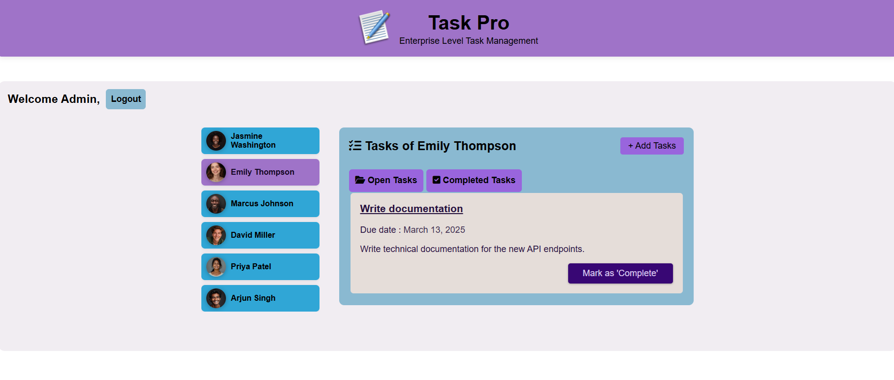

# Task Management App

This is a task management application used to create, update and delete tasks for various users. There is mock login given for admin and sample users. Form validation is present for eventhough it is mock login service. Dummy users and dummy tasks are given for ease of use to experience the extent of this app.Admin can add new tasks, update tasks as completed and delete tasks for all users. User can login and view only their tasks. They can set the task as completed but cannot create or delete tasks. Role based rendering is used based on login credentials stored in session storage. This app uses Directives, Services and Dependency Injection, Event binding, Property binding, Two-way Binding using NgModel, Template-driven forms and mock login service with session storage. 

This project was generated using [Angular CLI](https://github.com/angular/angular-cli) version 19.1.4.

## Live Demo

You can check demo [here](https://angulartaskpro.netlify.app).

## Preview



## Development server

To start a local development server, run:

```bash
ng serve
```

Once the server is running, open your browser and navigate to `http://localhost:4200/`. The application will automatically reload whenever you modify any of the source files.

## Code scaffolding

Angular CLI includes powerful code scaffolding tools. To generate a new component, run:

```bash
ng generate component component-name
```

For a complete list of available schematics (such as `components`, `directives`, or `pipes`), run:

```bash
ng generate --help
```

## Building

To build the project run:

```bash
ng build
```

This will compile your project and store the build artifacts in the `dist/` directory. By default, the production build optimizes your application for performance and speed.

## Running unit tests

To execute unit tests with the [Karma](https://karma-runner.github.io) test runner, use the following command:

```bash
ng test
```

## Running end-to-end tests

For end-to-end (e2e) testing, run:

```bash
ng e2e
```

Angular CLI does not come with an end-to-end testing framework by default. You can choose one that suits your needs.

## Additional Resources

For more information on using the Angular CLI, including detailed command references, visit the [Angular CLI Overview and Command Reference](https://angular.dev/tools/cli) page.
